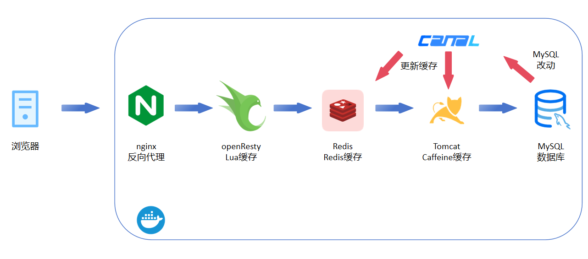

# MultiCache
多级缓存指导，内容仓库

### 概要
`start`文件夹作为跟随博文学习操作的初始文件夹。

`end`文件夹是已经把步骤做完的最终文件夹，可以作为参考。

[博文专栏https://blog.csdn.net/m0_51390969/category_12552064.html](https://blog.csdn.net/m0_51390969/category_12552064.html)

主要对`Lua缓存`、`Redis缓存`、`Caffeine缓存`进行实践，以及`缓存同步`实践。

最终的多级缓存架构大致如下。

### 环境参考

| Name | Version |
|--|--|
| Docker Desktop for Windows | 4.23.0 |
| Openjdk | 8 |
| MySQL | 8.2.0 |
| Redis | 7.2 |
| Canal | 1.1.7 |
| OpenResty | 1.21.4.3-3-jammy-amd64 |
| Lua | - |
| Caffeine| - |